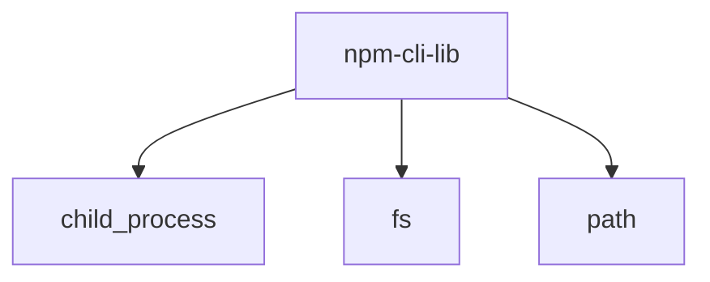

# Module: npm/cli/lib

[← Back to INDEX](../../INDEX.md)

**Type:** js/ts | **Files:** 1

**Entry point:** `npm/cli/lib/index.js`

## Files

| File | Lines | Large |
| ---- | ----- | ----- |
| `npm/cli/lib/index.js` | 73 |  |

---

## External Dependencies

Dependencies from other modules:

- `child_process`
- `fs`
- `path`
