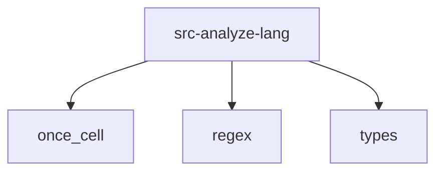

# Imports

[← Back to MODULE](MODULE.md) | [← Back to INDEX](../../INDEX.md)

## Dependency Graph

## Internal Dependencies

Dependencies within this module:

- `analyze`
- `c`
- `cpp`
- `csharp`
- `dart`
- `go`
- `java`
- `javascript`
- `php`
- `python`
- `ruby`
- `rust`
- `swift`

## External Dependencies

Dependencies from other modules:

- `once_cell`
- `regex`
- `types`

