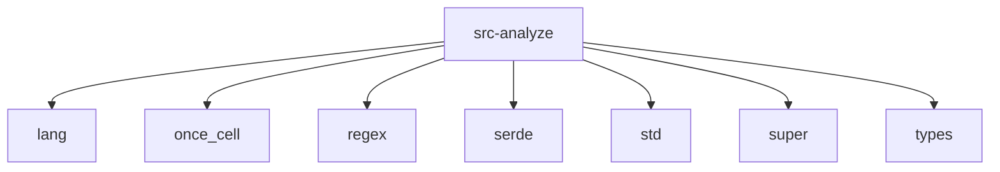

# Imports

[← Back to MODULE](MODULE.md) | [← Back to INDEX](../../INDEX.md)

## Dependency Graph

## Internal Dependencies

Dependencies within this module:

- `analyze`
- `graph`
- `memory`
- `module`
- `parser`

## External Dependencies

Dependencies from other modules:

- `lang`
- `once_cell`
- `regex`
- `serde`
- `std`
- `super`
- `types`

