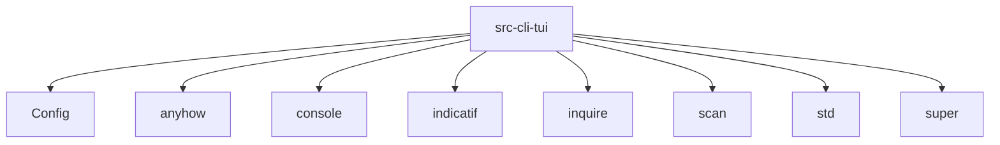

# Imports

[← Back to MODULE](MODULE.md) | [← Back to INDEX](../../INDEX.md)

## Dependency Graph

## Internal Dependencies

Dependencies within this module:

- `cli`
- `theme`
- `wizard`

## External Dependencies

Dependencies from other modules:

- `Config`
- `anyhow`
- `console`
- `indicatif`
- `inquire`
- `scan`
- `std`
- `super`

