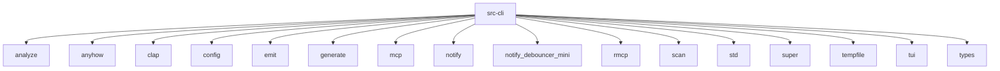

# Imports

[← Back to MODULE](MODULE.md) | [← Back to INDEX](../../INDEX.md)

## Dependency Graph

## Internal Dependencies

Dependencies within this module:

- `args`
- `check`
- `cli`
- `hooks`
- `serve`
- `telemetry`
- `templates`
- `update`
- `watch`

## External Dependencies

Dependencies from other modules:

- `analyze`
- `anyhow`
- `clap`
- `config`
- `emit`
- `generate`
- `mcp`
- `notify`
- `notify_debouncer_mini`
- `rmcp`
- `scan`
- `std`
- `super`
- `tempfile`
- `tui`
- `types`

