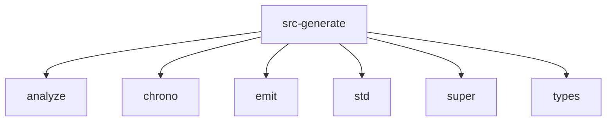

# Imports

[← Back to MODULE](MODULE.md) | [← Back to INDEX](../../INDEX.md)

## Dependency Graph

## Internal Dependencies

Dependencies within this module:

- `agent`
- `file_doc`
- `imports`
- `index`
- `memory`
- `module_content`
- `outline`
- `templates`

## External Dependencies

Dependencies from other modules:

- `analyze`
- `chrono`
- `emit`
- `std`
- `super`
- `types`

