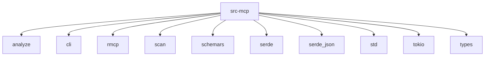

# Imports

[← Back to MODULE](MODULE.md) | [← Back to INDEX](../../INDEX.md)

## Dependency Graph

## Internal Dependencies

Dependencies within this module:

- `server`

## External Dependencies

Dependencies from other modules:

- `analyze`
- `cli`
- `rmcp`
- `scan`
- `schemars`
- `serde`
- `serde_json`
- `std`
- `tokio`
- `types`

