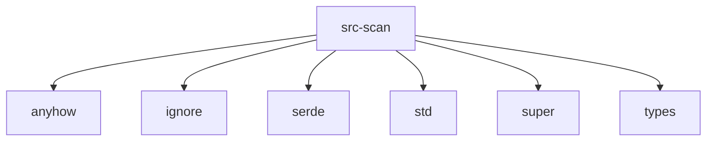

# Imports

[← Back to MODULE](MODULE.md) | [← Back to INDEX](../../INDEX.md)

## Dependency Graph

## Internal Dependencies

Dependencies within this module:

- `filter`
- `git`
- `remote`
- `walker`

## External Dependencies

Dependencies from other modules:

- `anyhow`
- `ignore`
- `serde`
- `std`
- `super`
- `types`

