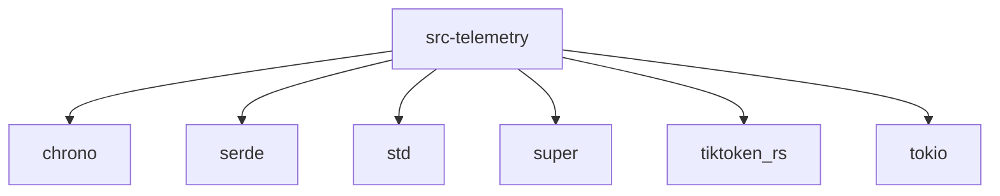

# Imports

[← Back to MODULE](MODULE.md) | [← Back to INDEX](../../INDEX.md)

## Dependency Graph

## Internal Dependencies

Dependencies within this module:

- `counter`
- `event`
- `storage`

## External Dependencies

Dependencies from other modules:

- `chrono`
- `serde`
- `std`
- `super`
- `tiktoken_rs`
- `tokio`

