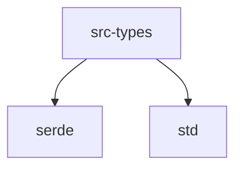

# Module: src/types

[← Back to INDEX](../../INDEX.md)

**Type:** rust | **Files:** 4

**Entry point:** `src/types/mod.rs`

## Files

| File | Lines | Large |
| ---- | ----- | ----- |
| `src/types/file.rs` | 103 |  |
| `src/types/memory.rs` | 107 |  |
| `src/types/mod.rs` | 7 |  |
| `src/types/symbol.rs` | 108 |  |

---

## Internal Dependencies

Dependencies within this module:

- `file`
- `memory`
- `symbol`

## External Dependencies

Dependencies from other modules:

- `serde`
- `std`
