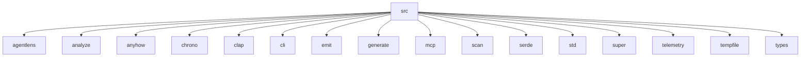

# Imports

[← Back to MODULE](MODULE.md) | [← Back to INDEX](../../INDEX.md)

## Dependency Graph

## Internal Dependencies

Dependencies within this module:

- `config`
- `runner`

## External Dependencies

Dependencies from other modules:

- `agentlens`
- `analyze`
- `anyhow`
- `chrono`
- `clap`
- `cli`
- `emit`
- `generate`
- `mcp`
- `scan`
- `serde`
- `std`
- `super`
- `telemetry`
- `tempfile`
- `types`

